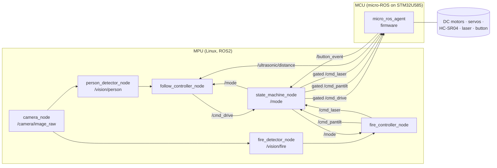

# UGV Antincendio (Follow + Fire) — Arduino Uno Q + ROS2
# Piano Implementativo — Wildfire Robotics Team

## Contesto
Progetto per il corso Design & Robotics 14° ed. Il team ha un robot in cartone con 2 ruote cingolate motorizzate; il PDF `Electronics.pdf` fissa la BOM. Rispetto al PDF:
- **Niente thermal camera / flame sensor**: il fuoco è rilevato solo via computer vision sulla gamma di colori (rosso/arancione) in HSV.
- **Aggiunto laser puntatore KY-008 5V** (pack ANGEEK) montato sul pan-tilt insieme alla camera.
- **HC-SR04 x2** vengono usati per mantenere la distanza dalla persona in FOLLOW (non per cercare il fuoco).

Il deliverable finale di questa pianificazione è un file **`Wildfire-Robotics/IMPLEMENTATION.md`** versionato nella repo con tutte le istruzioni implementative per ogni componente/file. Il codice verrà scritto in un secondo momento.

## Comportamento richiesto (da domande chiarite)
- **3 stati mutuamente esclusivi**: `IDLE → FOLLOW → FIRE → IDLE …`. Un unico push-button momentaneo fa ruotare gli stati. All'accensione parte in IDLE. Nessun LED di stato.
- **FOLLOW**: tracking di una persona generica via CV; il robot la segue col driving cingolato mantenendo la distanza letta dagli HC-SR04. Se la persona esce dal campo visivo → robot fermo in attesa, pan-tilt fermo.
- **FIRE**: ruote ferme. Il pan-tilt fa uno sweep finché il fire-detector non trova un blob di colore fuoco sopra soglia d'area; centratura del blob al centro del frame; **laser ON stabile solo a lock confermato** (errore di centratura < N px per ≥ 0.5 s). Uscendo da FIRE o perdendo il lock → laser OFF.
- **Alimentazione**: LIPO **11.1V 3S 2000mAh** (come tabella BOM, non lo schema a mano).

## Architettura hardware

Arduino Uno Q è una board dual-brain: un MPU Qualcomm Dragonwing (Debian Linux, abbastanza potente per ROS2 + CV onboard) + un MCU STM32U585 per I/O real-time. La separazione naturale è:
- **MPU (Linux)**: ROS2 Humble, camera USB, tutti i nodi di visione e controllo alto livello.
- **MCU (STM32U585)**: firmware micro-ROS; PWM servo, PWM motor driver, trigger/echo HC-SR04, GPIO laser, GPIO pulsante con debounce, watchdog motori.

### Distribuzione di potenza (dalla BOM)
```
LIPO 11.1V 3S ──XT60── switch principale
   ├─► 2× BTS7960 VCC_motor (11.1V)     → 1× DC motor ciascuno (sx/dx)
   ├─► UBEC YSIDO 8A  → 6V              → 2× servo MG996R (VCC servo)
   └─► XL6019 boost   → 5V              → Arduino Uno Q (5V rail)
                                          → KY-008 laser VCC
                                          → HC-SR04 x2 VCC
                                          → BTS7960 VCC_logic (5V) x2
```
**Nota hardware**: la BOM originale prevedeva un singolo TB6612FNG (dual H-bridge, 1.2 A). Lo schema realmente cablato dal team usa 2× **BTS7960** (half-bridge, 43 A picco), uno per motore. Il piano è stato aggiornato di conseguenza: pinout, driver firmware e tabella pin riflettono BTS7960. Vantaggio: ampio margine di corrente; svantaggio: 2 IC distinti, più pin di controllo (4 PWM totali invece di 2).
Tutti i GND comuni tramite WAGO 221-415. Pulsante tra GPIO MCU e GND con pull-up interno.

### Pin map (indicativa, da confermare sul datasheet Uno Q)
| Componente | Segnale | Lato | Pin Arduino UNO Q |
|---|---|---|---|
| BTS7960 #A (motore sx) | RPWM, LPWM, EN (R_EN+L_EN tied) | MCU 2 PWM + 1 GPIO | D3 (RPWM), D5 (LPWM), D4 (EN) |
| BTS7960 #B (motore dx) | RPWM, LPWM, EN (R_EN+L_EN tied) | MCU 2 PWM + 1 GPIO | D6 (RPWM), D11 (LPWM), D7 (EN) |
| Servo pan MG996R | PWM 50 Hz | MCU PWM | D9 |
| Servo tilt MG996R | PWM 50 Hz | MCU PWM | D10 |
| HC-SR04 #1 (front-left) | TRIG, ECHO | MCU 2 GPIO (ECHO EXTI) | A0 (TRIG), A1 (ECHO) |
| HC-SR04 #2 (front-right) | TRIG, ECHO | MCU 2 GPIO (ECHO EXTI) | A2 (TRIG), A3 (ECHO) |
| KY-008 laser | GPIO digital (5 V logic, active-high) | MCU 1 GPIO | D13 |
| Push button | GPIO input pull-up + debounce SW | MCU 1 GPIO (EXTI falling) | D2 |
| USB camera | USB UVC | MPU USB-A | — |

D0/D1 riservati a UART (transport micro-ROS verso MPU). A4/A5 lasciati liberi (I2C SDA/SCL, espansione futura). D8 e D12 liberi.

Tutti i 6 pin PWM hardware del header UNO R3-compatible (D3, D5, D6, D9, D10, D11) sono usati: 4 per i due BTS7960, 2 per i servo. Sotto c'è STM32U585AI quindi qualunque GPIO è EXTI-capable, ECHO e BUTTON non hanno vincolo INT0/INT1.

## Architettura software (ROS2 Humble)



**Gating centrale in `state_machine_node`**: i controller pubblicano sempre i loro comandi; lo state machine è l'unico nodo che ri-pubblica verso i topic consumati dal firmware, azzerandoli quando la modalità non corrisponde. Questo rende impossibile l'attivazione contemporanea FOLLOW+FIRE anche in caso di bug in un controller.

### Topic e messaggi custom (`wildfire_msgs`)
- `wildfire_msgs/msg/Mode.msg` — `uint8 mode` (0=IDLE, 1=FOLLOW, 2=FIRE)
- `wildfire_msgs/msg/ButtonEvent.msg` — `builtin_interfaces/Time stamp`, `uint8 kind` (0=press)
- `wildfire_msgs/msg/Detection.msg` — `bool found`, `float32 cx`, `float32 cy`, `float32 area`, `float32 img_w`, `float32 img_h`
- `wildfire_msgs/msg/DriveCmd.msg` — `float32 left` [-1..1], `float32 right` [-1..1]
- `wildfire_msgs/msg/PanTiltCmd.msg` — `float32 pan_deg`, `float32 tilt_deg`
- Laser usa `std_msgs/Bool` su `/cmd_laser`.
- Ultrasonici usano `sensor_msgs/Range` su `/ultrasonic/left` e `/ultrasonic/right`.

### Macchina a stati (dentro `state_machine_node`)
- Sottoscrive `/button_event`; ad ogni press ruota `IDLE → FOLLOW → FIRE → IDLE`.
- Pubblica `/mode` latched.
- Mantiene callback di forwarding: in IDLE azzera drive+pan-tilt+laser; in FOLLOW forwarda solo `cmd_drive`, pan-tilt riposizionato a home (0°,0°), laser off; in FIRE forwarda `cmd_pantilt` e `cmd_laser`, drive a 0.
- Watchdog: se dopo 500 ms non arriva comando dal controller attivo, pubblica comando neutro.

### Logica FOLLOW (`follow_controller_node`)
- Input: `/vision/person` + `/ultrasonic/left|right`.
- Se `found=false`: `left=right=0` (robot fermo, attende).
- Altrimenti:
    - errore orizzontale `ex = (cx - img_w/2) / (img_w/2)` → componente di rotazione.
    - distanza target es. 80 cm; errore = min(left,right) − 80 cm → componente lineare, saturata.
    - se min(left,right) < 40 cm → stop immediato (sicurezza).
    - mix differenziale: `left = v + ω`, `right = v − ω`, clamp [-1,1].

### Logica FIRE (`fire_controller_node`)
- Stato interno: `SWEEPING → TRACKING → LOCKED`.
- `SWEEPING`: pan da −60° a +60° con step, tilt costante 0°→+30° a ogni fine pan; laser OFF. Se `/vision/fire.found && area>Amin` → `TRACKING`.
- `TRACKING`: PD sui due assi `pan`, `tilt` per portare `(cx,cy)` al centro con errore `(ex,ey)`; laser OFF; se errore < soglia per 0.5 s → `LOCKED`.
- `LOCKED`: pan-tilt tiene la posizione, laser ON; se errore sale sopra soglia o `found=false` per > 0.3 s → torna a `TRACKING`/`SWEEPING`, laser OFF.

### Visione
- `camera_node`: wrapper su `cv_bridge` + OpenCV `VideoCapture` su UVC. 640×480 @ 15 fps sufficiente.
- `person_detector_node`: **YOLOv8n** (ultralytics) o MediaPipe Pose — default YOLOv8n, classe `person`, bbox con confidence > 0.5. Pubblica la detection più grande (più vicina).
- `fire_detector_node`: conversione BGR→HSV, maschera unione di due range (rosso `0..10` + `170..180`, arancione `11..25`) con S,V sopra soglia; morfologia open+close; `findContours` → blob più grande; pubblica centroide + area se area > soglia.

## Struttura file del progetto

```
Wildfire-Robotics/
├── IMPLEMENTATION.md                 ← file md richiesto, contiene TUTTE le istruzioni per-componente e per-file
├── docs/
│   ├── wiring_diagram.md             ← pinout tabellare + schema ASCII della BOM
│   └── state_machine.md              ← diagramma stati + transizioni
├── ros2_ws/
│   └── src/
│       ├── wildfire_msgs/            ← package pure-msgs
│       │   ├── msg/{Mode,ButtonEvent,Detection,DriveCmd,PanTiltCmd}.msg
│       │   ├── CMakeLists.txt
│       │   └── package.xml
│       ├── wildfire_vision/          ← python package
│       │   ├── wildfire_vision/{__init__.py,camera_node.py,
│       │   │   person_detector_node.py,fire_detector_node.py}
│       │   ├── resource/wildfire_vision
│       │   ├── package.xml
│       │   └── setup.py
│       ├── wildfire_control/         ← python package
│       │   ├── wildfire_control/{__init__.py,state_machine_node.py,
│       │   │   follow_controller_node.py,fire_controller_node.py}
│       │   ├── package.xml
│       │   └── setup.py
│       └── wildfire_bringup/
│           ├── launch/bringup.launch.py
│           ├── config/params.yaml
│           ├── package.xml
│           └── CMakeLists.txt
└── firmware/
    └── uno_q_mcu/                    ← firmware micro-ROS per STM32U585
        ├── platformio.ini o CMakeLists.txt
        ├── src/main.c
        ├── src/drivers/{motor_bts7960.c, servo_mg996r.c,
        │   ultrasonic_hcsr04.c, laser_ky008.c, button.c}
        └── include/pins.h
```

## Contenuto di `IMPLEMENTATION.md` (outline a scrivere nella fase di implementazione)
1. **Panoramica & BOM finale** (con KY-008 e senza flame sensor, note sulle modifiche rispetto al PDF).
2. **Wiring & alimentazione**: tabella pin per ogni componente; sequenza di accensione; sicurezza LIPO.
3. **Macchina a stati** con diagramma e tabella transizioni.
4. **ROS2 graph**: topic, QoS, rate attesi, messaggi custom.
5. **Per-file implementation notes**: per ciascun file sorgente elencato sopra, descrizione di: responsabilità, parametri ROS, topic in/out, pseudocodice degli step chiave, edge case da coprire (es. persona persa in FOLLOW, nessun blob fuoco in FIRE, brown-out LIPO).
6. **Firmware MCU**: ciclo principale, timer per PWM servo, ISR per HC-SR04, debounce pulsante, watchdog.
7. **Calibrazione**: range HSV del fuoco (procedura per settarli con foto di prova), soglia area minima, PID pan-tilt, guadagni FOLLOW, distanza target HC-SR04.
8. **Build & run**: `colcon build`, `source install/setup.bash`, `ros2 launch wildfire_bringup bringup.launch.py`, flashing firmware MCU.
9. **Verifica end-to-end** (vedi sotto).

## File critici da modificare/creare
- **Da creare** (nuovi): tutti i file sotto `Wildfire-Robotics/` — la cartella è oggi vuota.
- **Nessuna modifica** al PDF o ad altri file della repo.

## Verifica end-to-end
Da eseguire dopo l'implementazione, nell'ordine:
1. **Build ROS2**: `cd ros2_ws && colcon build` senza errori.
2. **Bench test MCU da solo**: flashare firmware, lanciare `micro-ros-agent`, verificare su `ros2 topic echo /ultrasonic/left` che i valori cambino avvicinando un ostacolo, e che `/button_event` venga emesso premendo il pulsante.
3. **Test attuatori via CLI**: `ros2 topic pub /cmd_drive ...` con robot sollevato → ruote girano nei due versi; `ros2 topic pub /cmd_pantilt ...` → pan-tilt si muove; `ros2 topic pub /cmd_laser ...` → laser accende/spegne. **Fatto via forwarder in stato DEBUG o bypassando temporaneamente lo state machine**.
4. **Test visione**: `ros2 run wildfire_vision person_detector_node`, `ros2 run rqt_image_view` sul bbox, verificare detection; idem `fire_detector_node` puntando una fiamma di accendino o una scheda arancione.
5. **Integration FOLLOW**: avvio `bringup.launch.py`, press pulsante → FOLLOW; camminare davanti al robot → lo insegue tenendo distanza; uscire dal frame → si ferma; rientrare → riprende.
6. **Integration FIRE**: altro press → FIRE; ruote devono restare ferme (test su pavimento); presentare fonte di colore fuoco dentro il campo del pan-tilt → pan-tilt si centra, laser si accende solo a lock; togliere la fonte → laser si spegne; altro press → IDLE, tutto a riposo.
7. **Mutua esclusione**: verificare che `/cmd_drive` rimanga 0 durante FIRE anche se si inietta un comando sporcio, e che pan-tilt non si muova in FOLLOW.
8. **Mutua esclusione**: verificare che `/cmd_drive` rimanga 0 durante FIRE anche se si inietta un comando sporcio, e che pan-tilt non si muova in FOLLOW.

## Rischi & mitigazioni note
- **Arduino Uno Q è nuovo (2025)**: documentazione ancora in evoluzione. Mitigazione: restare sul percorso supportato micro-ROS + Debian ROS2 Humble; se il bridge ufficiale non è ancora maturo, fallback a seriale UART custom tra MPU e MCU con protocollo a frame.
- **YOLOv8n potrebbe essere lento sulla MPU**: se < 5 fps, ripiego su MediaPipe Pose o HOG people detector OpenCV.
- **Cartone + LIPO 3S**: rispettare il layout con batteria bassa, fusibile in linea XT60 consigliato, interruttore principale prima di tutti i regolatori.

---

## 5. Configurazione e Build Firmware MCU

Il firmware MCU è un progetto **PlatformIO** (`framework = arduino`, `platform = ststm32`) configurato in `firmware/uno_q_mcu/platformio.ini`. Per buildare i nodi `micro-ROS` lato MCU servono i pacchetti di messaggi ROS2 di progetto resi disponibili al generatore di tipi della libreria `micro_ros_platformio`.

### 5.0 Bootstrap rapido (consigliato)

Lo script `_RTOS/setup_firmware.sh` automatizza tutti i passaggi che seguono (install PlatformIO, deps di sistema, symlink dei messaggi, primo build con workaround `rmw_test_fixture`). Idempotente, funziona su Linux (incluso il container `ros2_dev`) e macOS.

```bash
# Dentro il container docker (consigliato):
bash /home/project/_RTOS/setup_firmware.sh

# Oppure dall'host:
bash _RTOS/setup_firmware.sh
```

Output atteso al termine:

```
=== Firmware build OK ===
Output: .../firmware/uno_q_mcu/.pio/build/uno_q_mcu/firmware.bin
```

Le sezioni 5.1-5.3 documentano gli stessi passaggi a mano, utili per debug o per modifiche puntuali.

### 5.1 Linkare i messaggi custom (`wildfire_msgs`)

`micro_ros_platformio` scansiona alla prima build una cartella `extra_packages/` (peer del file `platformio.ini`) e include automaticamente ogni pacchetto ROS2 trovato nei tipi compilati dentro `libmicroros.a`. Il pacchetto `wildfire_msgs` esiste già lato MPU sotto `ros2_ws/src/wildfire_msgs/`, va esposto al firmware:

```bash
cd Wildfire-Robotics/firmware/uno_q_mcu/
mkdir -p extra_packages
ln -s ../../ros2_ws/src/wildfire_msgs extra_packages/wildfire_msgs
```

> Su filesystem che non supportano symlink (es. FAT32 di una microSD) usare `cp -r` invece di `ln -s` e ricordarsi di risincronizzare ad ogni modifica dei `.msg`.

Per ridurre il footprint binario è opportuno disabilitare i pacchetti micro-ROS non usati tramite un file `colcon.meta` allo stesso livello di `platformio.ini`:

```json
{
  "names": {
    "tracetools": { "cmake-args": ["-DBUILD_TESTING=OFF"] },
    "rosidl_typesupport_introspection_c": {
      "cmake-args": ["-DBUILD_TESTING=OFF"]
    }
  },
  "packages-skip": [
    "rcl_logging_log4cxx",
    "rcl_logging_spdlog",
    "rcl_yaml_param_parser"
  ]
}
```

Dopo qualunque modifica a `extra_packages/` o a `colcon.meta` forzare la rigenerazione della libreria:

```bash
cd Wildfire-Robotics/firmware/uno_q_mcu/
rm -rf .pio/libdeps/uno_q_mcu/micro_ros_platformio/libmicroros
pio run -e uno_q_mcu
```

La prima build è lunga (~5-10 min) perché compila il client `micro-ROS` con tutti i tipi.

### 5.2 Comandi PlatformIO

| Operazione | Comando |
|---|---|
| Build | `pio run -e uno_q_mcu` |
| Upload via ST-LINK on-board | `pio run -e uno_q_mcu -t upload` |
| Monitor seriale | `pio device monitor -b 115200` |
| Pulizia build | `pio run -e uno_q_mcu -t clean` |
| Forzare rebuild di `libmicroros` | `rm -rf .pio/libdeps/uno_q_mcu/micro_ros_platformio/libmicroros` |

### 5.3 Risoluzione board UNO Q

Finché Arduino non pubblica un board id ufficiale per UNO Q, in `platformio.ini` è in uso il placeholder `b_u585i_iot02a` con override `board_build.mcu = stm32u585aii6q` e `board_build.f_cpu = 160000000L`. Quando il board id ufficiale è disponibile:

```ini
board = arduino_uno_q
; rimuovere board_build.mcu e board_build.f_cpu
```

---

## 6. Setup micro-ROS Agent

L'Agent gira sulla **MPU** (lato Linux della UNO Q). È il bridge che riceve i frame XRCE-DDS dal firmware via UART e li espone come topic ROS2 nativi.

### 6.1 Installazione

Su Debian/ROS2 Humble preferire il pacchetto pre-built:

```bash
sudo apt update
sudo apt install ros-humble-micro-ros-agent
```

Se il pacchetto non è disponibile per l'arch della MPU, build da source dentro un workspace dedicato:

```bash
mkdir -p ~/uros_ws/src && cd ~/uros_ws
git clone -b humble https://github.com/micro-ROS/micro-ROS-Agent.git src/micro-ROS-Agent
git clone -b humble https://github.com/micro-ROS/micro_ros_msgs.git src/micro_ros_msgs
rosdep install --from-paths src --ignore-src -y
colcon build
source install/local_setup.bash
```

### 6.2 Identificare il device UART MPU↔MCU

UNO Q espone il bridge UART interno tra MPU e MCU come `/dev/tty*`. Identificare il device prima di lanciare l'agent:

```bash
ls -l /dev/serial/by-id/        # link stabili
dmesg | tail -n 20              # eventi USB/UART recenti
```

Il path tipico è `/dev/ttyACM0` o `/dev/ttyAMA*`. Annotarlo in `wildfire_bringup/config/params.yaml` come parametro `mcu_serial_dev`.

### 6.3 Avvio manuale (per bench test)

```bash
ros2 run micro_ros_agent micro_ros_agent serial \
    --dev /dev/ttyACM0 -b 115200 -v6
```

In console il flag `-v6` mostra i messaggi XRCE-DDS in chiaro, utile per diagnosticare la handshake del firmware. Quando il firmware completa `create_entities()` apparirà la lista dei publisher/subscriber.

### 6.4 Avvio come servizio systemd

Per lasciare l'agent sempre attivo creare `/etc/systemd/system/micro-ros-agent.service`:

```ini
[Unit]
Description=micro-ROS Agent for Wildfire UGV
After=network.target

[Service]
Type=simple
ExecStart=/bin/bash -lc 'source /opt/ros/humble/setup.bash && \
    ros2 run micro_ros_agent micro_ros_agent serial \
    --dev /dev/ttyACM0 -b 115200'
Restart=on-failure
RestartSec=2
User=robot

[Install]
WantedBy=multi-user.target
```

Abilitare:

```bash
sudo systemctl daemon-reload
sudo systemctl enable --now micro-ros-agent
sudo systemctl status micro-ros-agent
```

### 6.5 Integrazione nel launch file

Per startup pulito durante demo, aggiungere l'agent come `ExecuteProcess` in `wildfire_bringup/launch/bringup.launch.py`:

```python
ExecuteProcess(
    cmd=['ros2', 'run', 'micro_ros_agent', 'micro_ros_agent',
         'serial', '--dev', '/dev/ttyACM0', '-b', '115200'],
    output='screen'
)
```

---

## 7. Calibrazione

Tutti i parametri tarabili vivono in `wildfire_bringup/config/params.yaml` e vengono caricati da `bringup.launch.py`. La sequenza consigliata: prima i sensori (HSV fuoco, soglia area), poi gli attuatori (limiti servo), infine i loop di controllo (PD pan-tilt, FOLLOW).

### 7.1 Range HSV del fuoco (`fire_detector_node`)

Il rilevatore costruisce una maschera come unione di due range HSV: rosso (basso e alto, perché H wrap-around) + arancione. Default da paper:

| Range | H min | H max | S min | V min |
|---|---|---|---|---|
| Rosso 1 | 0   | 10  | 100 | 100 |
| Rosso 2 | 170 | 180 | 100 | 100 |
| Arancione | 11  | 25  | 100 | 100 |

Procedura di taratura:

1. Posizionare la camera nelle condizioni di luce reali della demo.
2. Catturare 5-10 foto della sorgente fuoco (fiamma di accendino, scheda colorata).
3. Eseguire lo script di tuning con trackbar OpenCV:

   ```bash
   python3 _LINUX/src/ros2_ws/src/wildfire_vision/scripts/hsv_tuner.py \
       --image calibration/fire_01.jpg
   ```

4. Muovere gli slider H/S/V min/max finché la maschera contiene **solo** la fiamma.
5. Ripetere su tutte le foto: scegliere il range che funziona su tutte (intersezione degli intervalli buoni).
6. Scrivere i valori finali in `params.yaml` sotto `fire_detector_node.ros__parameters.hsv_*`.

### 7.2 Soglia area minima del blob fuoco

Empirica: a 640×480 una fiamma di accendino a 1 m occupa ~200-500 px². Default conservativo `min_area_px = 300`. Se troppi falsi positivi alzare a 800-1000. Verificare con:

```bash
ros2 topic echo /vision/fire
# leggere il campo `area`
```

### 7.3 Limiti fisici servo (`servo_set_limits`)

Limiti software per evitare collisioni meccaniche pan-tilt. Procedura:

1. Robot acceso, modalità debug (state machine bypassata).
2. Iniettare comandi crescenti:
   ```bash
   ros2 topic pub --once /cmd_pantilt wildfire_msgs/msg/PanTiltCmd \
       '{pan_deg: 0.0, tilt_deg: 0.0}'
   ```
3. Incrementare di 10° in 10° finché non si vede contatto fisico col telaio.
4. Tornare indietro di 5° → quello è il limite hardware.
5. Aggiornare i default in `servo_mg996r.cpp::g_state` o richiamare `servo_set_limits()` da `setup()` con i valori reali.

### 7.4 Guadagni PD pan-tilt (`fire_controller_node`)

Modalità TRACKING usa PD su errore di centratura `(ex, ey) = (cx - W/2, cy - H/2)`:

```
pan_cmd  += Kp_pan  * ex + Kd_pan  * d(ex)/dt
tilt_cmd += Kp_tilt * ey + Kd_tilt * d(ey)/dt
```

Tuning manuale:

1. Partire con `Kp = 0.05 deg/px`, `Kd = 0.0`.
2. Presentare la sorgente fuoco: il pan-tilt deve avvicinarsi al centro senza overshoot.
3. Se troppo lento → `Kp` × 1.5; se oscilla → aggiungere `Kd ≈ 0.2 * Kp`.
4. Soglia di lock `lock_error_px = 15` (errore < 15 px per ≥ 0.5 s → laser ON).

### 7.5 Guadagni FOLLOW (`follow_controller_node`)

Loop FOLLOW usa due termini disaccoppiati:

```
omega = Kp_rot * (cx_norm)              # rotazione su errore orizzontale
v     = Kp_lin * (min(d_left, d_right) - d_target)
left  = clamp(v + omega, -1, 1)
right = clamp(v - omega, -1, 1)
```

| Parametro | Default | Range tipico |
|---|---|---|
| `Kp_rot` | 0.6 | 0.3 - 1.0 |
| `Kp_lin` | 0.01 (per cm) | 0.005 - 0.02 |
| `d_target_cm` | 80 | 50 - 120 |
| `d_safety_stop_cm` | 40 | 20 - 50 |

Procedura: robot a terra, persona di test cammina avanti/indietro a velocità costante. Aumentare `Kp_lin` finché il robot mantiene la distanza senza yo-yo. Aumentare `Kp_rot` finché segue le svolte senza perdere il bersaglio dal frame.

---

## 8. Procedure di Test e Validazione

Test eseguiti in due passi: prima **bench test isolato** dell'MCU (firmware + agent, niente nodi MPU), poi **integration test** dello stack completo.

### 8.1 Bench test isolato MCU

Obiettivo: confermare che il firmware esponga correttamente publisher/subscriber e reagisca ai topic.

**Setup**:
- Robot sollevato (ruote sospese).
- Alimentazione su.
- Firmware flashato (`pio run -t upload`).
- Agent attivo (`systemctl status micro-ros-agent`).

**Verifica grafo**:

```bash
ros2 node list
# atteso: /uno_q_mcu_node

ros2 topic list
# atteso (almeno):
#   /ultrasonic/left
#   /ultrasonic/right
#   /button_event
#   /cmd_drive
#   /cmd_pantilt
#   /cmd_laser
```

**Test sensori**:

```bash
# Ultrasuoni: avvicinare la mano, il valore deve scendere.
ros2 topic echo /ultrasonic/left

# Pulsante: ad ogni press deve apparire un nuovo messaggio.
ros2 topic echo /button_event
```

**Test attuatori** (robot sollevato!):

```bash
# Drive: ruote girano in avanti.
ros2 topic pub --once /cmd_drive wildfire_msgs/msg/DriveCmd \
    '{left: 0.3, right: 0.3}'

# Drive opposto.
ros2 topic pub --once /cmd_drive wildfire_msgs/msg/DriveCmd \
    '{left: -0.3, right: 0.3}'

# Pan-tilt.
ros2 topic pub --once /cmd_pantilt wildfire_msgs/msg/PanTiltCmd \
    '{pan_deg: 30.0, tilt_deg: 10.0}'

# Laser ON / OFF.
ros2 topic pub --once /cmd_laser std_msgs/msg/Bool 'data: true'
ros2 topic pub --once /cmd_laser std_msgs/msg/Bool 'data: false'
```

**Test watchdog motori**:

```bash
# Pubblica drive non-zero, poi smetti.
ros2 topic pub /cmd_drive wildfire_msgs/msg/DriveCmd \
    '{left: 0.3, right: 0.3}' --rate 5
# Ctrl+C dopo 5 s. Le ruote devono fermarsi entro 500 ms.
```

### 8.2 Integration test full stack

**Setup**:

```bash
cd Wildfire-Robotics/_LINUX/src/ros2_ws
source install/setup.bash
ros2 launch wildfire_bringup bringup.launch.py
```

**Verifica nodi** (in altro terminale):

```bash
ros2 node list
# atteso:
#   /uno_q_mcu_node
#   /camera_node
#   /person_detector_node
#   /fire_detector_node
#   /follow_controller_node
#   /fire_controller_node
#   /state_machine_node
```

**Sequenza stati**:

```bash
ros2 topic echo /mode &
# Press fisico sul pulsante:
#   IDLE -> FOLLOW -> FIRE -> IDLE -> ...
```

**Test FOLLOW** (robot a terra, area sgombra):

1. Press pulsante → modalità FOLLOW.
2. Camminare davanti al robot a velocità moderata.
3. Verificare che insegua mantenendo `d_target_cm`.
4. Uscire dal frame → robot deve fermarsi (`left=right=0`).
5. Rientrare → riprende il follow.

**Test FIRE** (robot fermo, su pavimento):

1. Press pulsante → modalità FIRE.
2. **Le ruote devono restare ferme** (`/cmd_drive` gated a 0).
3. Pan-tilt esegue sweep automatico.
4. Presentare fonte di colore fuoco al centro del FOV.
5. Pan-tilt deve centrarsi sulla sorgente.
6. **Laser si accende solo a lock confermato** (errore < soglia per ≥ 0.5 s).
7. Rimuovere la sorgente → laser si spegne entro 0.3 s.

**Test mutua esclusione** (critico):

```bash
# In modalità FIRE, iniettare drive sporco:
ros2 topic pub /cmd_drive wildfire_msgs/msg/DriveCmd \
    '{left: 0.5, right: 0.5}' --rate 10

# Sul firmware: motori devono restare a 0 (state_machine_node fa gating).
ros2 topic echo /cmd_drive  # quello che arriva al MCU, gated
```

Stesso test in FOLLOW iniettando `/cmd_pantilt` non-zero: pan-tilt deve restare a home.

### 8.3 Checklist di accettazione

- [ ] `ros2 node list` mostra tutti i nodi attesi
- [ ] `/ultrasonic/left|right` pubblica a ~10 Hz con valori plausibili
- [ ] `/button_event` emesso ad ogni press fisico, no rimbalzi
- [ ] Drive risponde, watchdog ferma i motori in < 600 ms
- [ ] Pan-tilt risponde, rispetta i limiti software
- [ ] Laser ON/OFF deterministico
- [ ] Transizione stato IDLE→FOLLOW→FIRE→IDLE corretta
- [ ] FOLLOW mantiene distanza target ±10 cm
- [ ] FIRE: laser ON solo a lock, OFF in <300 ms a perdita
- [ ] Mutua esclusione FIRE↔FOLLOW verificata su entrambi i topic

---

## 9. Sicurezza Alimentazione

La LIPO 3S 11.1 V 2000 mAh eroga correnti di picco elevate (decine di A). Il layout di alimentazione deve essere progettato per gestire guasti hardware e brown-out senza danneggiare componenti o causare comportamenti inattesi degli attuatori.

### 9.1 Fusibile XT60 in linea

**Obbligatorio** un fusibile dimensionato sulla corrente di stallo dei motori, montato fra il connettore XT60 della LIPO e lo switch principale.

| Componente | Corrente nominale | Stallo |
|---|---|---|
| 2× motore DC cingolato | ~1 A | ~3-4 A |
| 2× servo MG996R | ~0.5 A | ~2.5 A |
| Logica + sensori + laser | ~0.3 A | – |
| **Totale picco peggiore** | – | **~15 A** |

Fusibile consigliato: **20 A blade ATO** o **fusibile lama auto da 15 A** (margine 30 %). Tipo "fast blow". In caso di corto franco verso GND interrompe in < 50 ms, prima che la LIPO entri in scarica violenta.

### 9.2 Switch principale

Lo switch SPST (visibile in schema come `SW1`) **deve essere a monte di tutti i regolatori** (XL6019 boost, UBEC, ingresso BTS7960). Mai posizionarlo dopo un regolatore, perché i condensatori a valle restano carichi e possono causare sequenze di accensione anomale.

Caratteristiche minime: **30 A continui**, contatti placcati argento, leva di lunghezza adeguata per spegnimento rapido in emergenza.

### 9.3 Brown-out della LIPO

Una 3S sotto carico cala di tensione proporzionalmente allo stato di carica:

| Stato carica | V/cella | V totale | Comportamento |
|---|---|---|---|
| 100 % | 4.20 | 12.6 | normale |
| 50 % | 3.85 | 11.55 | normale |
| 20 % | 3.65 | 10.95 | **soglia di allarme** |
| 5 % | 3.30 | 9.9 | **rischio danno cella** |
| 0 % | 3.00 | 9.0 | LIPO fuori uso |

**Sotto 10.5 V (3.5 V/cella)** smettere immediatamente di usare la batteria. Sotto 9.0 V si rovinano permanentemente le celle.

Effetti di brown-out sul firmware MCU:
- L'XL6019 esce dalla regolazione → MCU resetta in modo sporco.
- I servo MG996R sotto coppia possono richiamare picchi che fanno crollare ulteriormente la VBUS.
- Letture HC-SR04 diventano rumorose (Vcc < 4.7 V).

Mitigazioni implementate nel firmware:
- Watchdog motori a 500 ms (§4 IMPLEMENTATION.md): se la connessione micro-ROS cade, motori azzerati.
- Stato `AGENT_DISCONNECTED` in `main.cpp`: alla perdita dell'agent il firmware azzera motori e laser e tenta riconnessione.
- `motor_disable()` disponibile per coast esplicito in stati di basso consumo (IDLE).

Mitigazioni aggiuntive consigliate:
- Voltmetro buzzer sulla LIPO (low-voltage alarm a 3.3 V/cella).
- Misura periodica VBUS via ADC della MCU (TODO firmware): pubblicare `/battery_voltage` come `std_msgs/Float32` per sorveglianza lato MPU.
- Disabilitare automaticamente il laser e ridurre PWM motori sotto soglia di tensione.

### 9.4 Sequenza di accensione e spegnimento

**Accensione**:
1. Verificare LIPO carica (≥ 11.5 V a riposo).
2. Verificare che lo switch principale sia OFF.
3. Connettere XT60.
4. Switch ON. Attendere boot Linux MPU (~30 s).
5. Verificare LED status MCU e systemd `micro-ros-agent`.
6. Solo allora avviare il launch file ROS2.

**Spegnimento**:
1. Press pulsante fino a tornare in IDLE (tutto fermo).
2. `Ctrl+C` sul launch file.
3. `sudo shutdown -h now` su MPU (mai staccare a caldo: rischio FS corruption).
4. Switch OFF.
5. Disconnettere XT60.
6. Stoccare LIPO a 3.8 V/cella se inutilizzata > 48 h.

### 9.5 GND comune

Tutti i ritorni di massa (LIPO, motor driver, MCU, sensori, laser) devono confluire in un **unico nodo Wago 221-415**. Mai instradare la massa in serie (daisy chain): le cadute di tensione sui tratti di ritorno generano offset spuri sui segnali logici e letture HC-SR04 instabili.