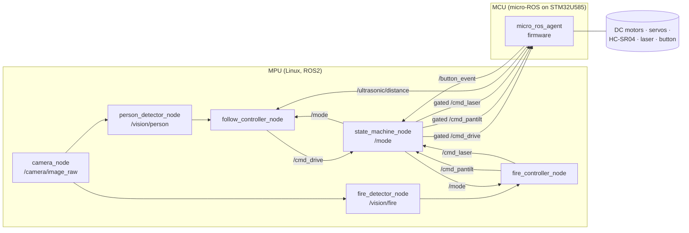

# UGV Antincendio (Follow + Fire) — Arduino Uno Q + ROS2
# Piano Implementativo — Wildfire Robotics Team

## Contesto
Progetto per il corso Design & Robotics 14° ed. Il team ha un robot in cartone con 2 ruote cingolate motorizzate; il PDF `Electronics.pdf` fissa la BOM. Rispetto al PDF:
- **Niente thermal camera / flame sensor**: il fuoco è rilevato solo via computer vision sulla gamma di colori (rosso/arancione) in HSV.
- **Aggiunto laser puntatore KY-008 5V** (pack ANGEEK) montato sul pan-tilt insieme alla camera.
- **HC-SR04 x2** vengono usati per mantenere la distanza dalla persona in FOLLOW (non per cercare il fuoco).

Il deliverable finale di questa pianificazione è un file **`Wildfire-Robotics/IMPLEMENTATION.md`** versionato nella repo con tutte le istruzioni implementative per ogni componente/file. Il codice verrà scritto in un secondo momento.

## Comportamento richiesto (da domande chiarite)
- **3 stati mutuamente esclusivi**: `IDLE → FOLLOW → FIRE → IDLE …`. Un unico push-button momentaneo fa ruotare gli stati. All'accensione parte in IDLE. Nessun LED di stato.
- **FOLLOW**: tracking di una persona generica via CV; il robot la segue col driving cingolato mantenendo la distanza letta dagli HC-SR04. Se la persona esce dal campo visivo → robot fermo in attesa, pan-tilt fermo.
- **FIRE**: ruote ferme. Il pan-tilt fa uno sweep finché il fire-detector non trova un blob di colore fuoco sopra soglia d'area; centratura del blob al centro del frame; **laser ON stabile solo a lock confermato** (errore di centratura < N px per ≥ 0.5 s). Uscendo da FIRE o perdendo il lock → laser OFF.
- **Alimentazione**: LIPO **11.1V 3S 2000mAh** (come tabella BOM, non lo schema a mano).

## Architettura hardware

Arduino Uno Q è una board dual-brain: un MPU Qualcomm Dragonwing (Debian Linux, abbastanza potente per ROS2 + CV onboard) + un MCU STM32U585 per I/O real-time. La separazione naturale è:
- **MPU (Linux)**: ROS2 Humble, camera USB, tutti i nodi di visione e controllo alto livello.
- **MCU (STM32U585)**: firmware micro-ROS; PWM servo, PWM motor driver, trigger/echo HC-SR04, GPIO laser, GPIO pulsante con debounce, watchdog motori.

### Distribuzione di potenza (dalla BOM)
```
LIPO 11.1V 3S ──XT60── switch principale
   ├─► TB6612FNG VM (11.1V)             → 2× DC motor
   ├─► UBEC YSIDO 8A  → 6V              → 2× servo MG996R (VCC servo)
   └─► XL6019 buck    → 5V              → Arduino Uno Q VIN 5V rail
                                          → KY-008 laser VCC
                                          → HC-SR04 x2 VCC
```
Tutti i GND comuni tramite WAGO 221-415. Pulsante tra GPIO MCU e GND con pull-up interno.

### Pin map (indicativa, da confermare sul datasheet Uno Q)
| Componente | Segnale | Lato |
|---|---|---|
| TB6612FNG | AIN1, AIN2, PWMA, BIN1, BIN2, PWMB, STBY | MCU (6 GPIO + 2 PWM + 1 standby) |
| Servo pan MG996R | PWM 50 Hz | MCU PWM |
| Servo tilt MG996R | PWM 50 Hz | MCU PWM |
| HC-SR04 #1 (front-left) | TRIG, ECHO | MCU 2 GPIO |
| HC-SR04 #2 (front-right) | TRIG, ECHO | MCU 2 GPIO |
| KY-008 laser | GPIO digital (5 V logic OK, signal pin) | MCU 1 GPIO |
| Push button | GPIO input w/ pull-up + debounce HW (RC) e SW | MCU 1 GPIO |
| USB camera | USB UVC | MPU USB-A |

## Architettura software (ROS2 Humble)



**Gating centrale in `state_machine_node`**: i controller pubblicano sempre i loro comandi; lo state machine è l'unico nodo che ri-pubblica verso i topic consumati dal firmware, azzerandoli quando la modalità non corrisponde. Questo rende impossibile l'attivazione contemporanea FOLLOW+FIRE anche in caso di bug in un controller.

### Topic e messaggi custom (`wildfire_msgs`)
- `wildfire_msgs/msg/Mode.msg` — `uint8 mode` (0=IDLE, 1=FOLLOW, 2=FIRE)
- `wildfire_msgs/msg/ButtonEvent.msg` — `builtin_interfaces/Time stamp`, `uint8 kind` (0=press)
- `wildfire_msgs/msg/Detection.msg` — `bool found`, `float32 cx`, `float32 cy`, `float32 area`, `float32 img_w`, `float32 img_h`
- `wildfire_msgs/msg/DriveCmd.msg` — `float32 left` [-1..1], `float32 right` [-1..1]
- `wildfire_msgs/msg/PanTiltCmd.msg` — `float32 pan_deg`, `float32 tilt_deg`
- Laser usa `std_msgs/Bool` su `/cmd_laser`.
- Ultrasonici usano `sensor_msgs/Range` su `/ultrasonic/left` e `/ultrasonic/right`.

### Macchina a stati (dentro `state_machine_node`)
- Sottoscrive `/button_event`; ad ogni press ruota `IDLE → FOLLOW → FIRE → IDLE`.
- Pubblica `/mode` latched.
- Mantiene callback di forwarding: in IDLE azzera drive+pan-tilt+laser; in FOLLOW forwarda solo `cmd_drive`, pan-tilt riposizionato a home (0°,0°), laser off; in FIRE forwarda `cmd_pantilt` e `cmd_laser`, drive a 0.
- Watchdog: se dopo 500 ms non arriva comando dal controller attivo, pubblica comando neutro.

### Logica FOLLOW (`follow_controller_node`)
- Input: `/vision/person` + `/ultrasonic/left|right`.
- Se `found=false`: `left=right=0` (robot fermo, attende).
- Altrimenti:
    - errore orizzontale `ex = (cx - img_w/2) / (img_w/2)` → componente di rotazione.
    - distanza target es. 80 cm; errore = min(left,right) − 80 cm → componente lineare, saturata.
    - se min(left,right) < 40 cm → stop immediato (sicurezza).
    - mix differenziale: `left = v + ω`, `right = v − ω`, clamp [-1,1].

### Logica FIRE (`fire_controller_node`)
- Stato interno: `SWEEPING → TRACKING → LOCKED`.
- `SWEEPING`: pan da −60° a +60° con step, tilt costante 0°→+30° a ogni fine pan; laser OFF. Se `/vision/fire.found && area>Amin` → `TRACKING`.
- `TRACKING`: PD sui due assi `pan`, `tilt` per portare `(cx,cy)` al centro con errore `(ex,ey)`; laser OFF; se errore < soglia per 0.5 s → `LOCKED`.
- `LOCKED`: pan-tilt tiene la posizione, laser ON; se errore sale sopra soglia o `found=false` per > 0.3 s → torna a `TRACKING`/`SWEEPING`, laser OFF.

### Visione
- `camera_node`: wrapper su `cv_bridge` + OpenCV `VideoCapture` su UVC. 640×480 @ 15 fps sufficiente.
- `person_detector_node`: **YOLOv8n** (ultralytics) o MediaPipe Pose — default YOLOv8n, classe `person`, bbox con confidence > 0.5. Pubblica la detection più grande (più vicina).
- `fire_detector_node`: conversione BGR→HSV, maschera unione di due range (rosso `0..10` + `170..180`, arancione `11..25`) con S,V sopra soglia; morfologia open+close; `findContours` → blob più grande; pubblica centroide + area se area > soglia.

## Struttura file del progetto

```
Wildfire-Robotics/
├── IMPLEMENTATION.md                 ← file md richiesto, contiene TUTTE le istruzioni per-componente e per-file
├── docs/
│   ├── wiring_diagram.md             ← pinout tabellare + schema ASCII della BOM
│   └── state_machine.md              ← diagramma stati + transizioni
├── ros2_ws/
│   └── src/
│       ├── wildfire_msgs/            ← package pure-msgs
│       │   ├── msg/{Mode,ButtonEvent,Detection,DriveCmd,PanTiltCmd}.msg
│       │   ├── CMakeLists.txt
│       │   └── package.xml
│       ├── wildfire_vision/          ← python package
│       │   ├── wildfire_vision/{__init__.py,camera_node.py,
│       │   │   person_detector_node.py,fire_detector_node.py}
│       │   ├── resource/wildfire_vision
│       │   ├── package.xml
│       │   └── setup.py
│       ├── wildfire_control/         ← python package
│       │   ├── wildfire_control/{__init__.py,state_machine_node.py,
│       │   │   follow_controller_node.py,fire_controller_node.py}
│       │   ├── package.xml
│       │   └── setup.py
│       └── wildfire_bringup/
│           ├── launch/bringup.launch.py
│           ├── config/params.yaml
│           ├── package.xml
│           └── CMakeLists.txt
└── firmware/
    └── uno_q_mcu/                    ← firmware micro-ROS per STM32U585
        ├── platformio.ini o CMakeLists.txt
        ├── src/main.c
        ├── src/drivers/{motor_tb6612.c, servo_mg996r.c,
        │   ultrasonic_hcsr04.c, laser_ky008.c, button.c}
        └── include/pins.h
```

## Contenuto di `IMPLEMENTATION.md` (outline a scrivere nella fase di implementazione)
1. **Panoramica & BOM finale** (con KY-008 e senza flame sensor, note sulle modifiche rispetto al PDF).
2. **Wiring & alimentazione**: tabella pin per ogni componente; sequenza di accensione; sicurezza LIPO.
3. **Macchina a stati** con diagramma e tabella transizioni.
4. **ROS2 graph**: topic, QoS, rate attesi, messaggi custom.
5. **Per-file implementation notes**: per ciascun file sorgente elencato sopra, descrizione di: responsabilità, parametri ROS, topic in/out, pseudocodice degli step chiave, edge case da coprire (es. persona persa in FOLLOW, nessun blob fuoco in FIRE, brown-out LIPO).
6. **Firmware MCU**: ciclo principale, timer per PWM servo, ISR per HC-SR04, debounce pulsante, watchdog.
7. **Calibrazione**: range HSV del fuoco (procedura per settarli con foto di prova), soglia area minima, PID pan-tilt, guadagni FOLLOW, distanza target HC-SR04.
8. **Build & run**: `colcon build`, `source install/setup.bash`, `ros2 launch wildfire_bringup bringup.launch.py`, flashing firmware MCU.
9. **Verifica end-to-end** (vedi sotto).

## File critici da modificare/creare
- **Da creare** (nuovi): tutti i file sotto `Wildfire-Robotics/` — la cartella è oggi vuota.
- **Nessuna modifica** al PDF o ad altri file della repo.

## Verifica end-to-end
Da eseguire dopo l'implementazione, nell'ordine:
1. **Build ROS2**: `cd ros2_ws && colcon build` senza errori.
2. **Bench test MCU da solo**: flashare firmware, lanciare `micro-ros-agent`, verificare su `ros2 topic echo /ultrasonic/left` che i valori cambino avvicinando un ostacolo, e che `/button_event` venga emesso premendo il pulsante.
3. **Test attuatori via CLI**: `ros2 topic pub /cmd_drive ...` con robot sollevato → ruote girano nei due versi; `ros2 topic pub /cmd_pantilt ...` → pan-tilt si muove; `ros2 topic pub /cmd_laser ...` → laser accende/spegne. **Fatto via forwarder in stato DEBUG o bypassando temporaneamente lo state machine**.
4. **Test visione**: `ros2 run wildfire_vision person_detector_node`, `ros2 run rqt_image_view` sul bbox, verificare detection; idem `fire_detector_node` puntando una fiamma di accendino o una scheda arancione.
5. **Integration FOLLOW**: avvio `bringup.launch.py`, press pulsante → FOLLOW; camminare davanti al robot → lo insegue tenendo distanza; uscire dal frame → si ferma; rientrare → riprende.
6. **Integration FIRE**: altro press → FIRE; ruote devono restare ferme (test su pavimento); presentare fonte di colore fuoco dentro il campo del pan-tilt → pan-tilt si centra, laser si accende solo a lock; togliere la fonte → laser si spegne; altro press → IDLE, tutto a riposo.
7. **Mutua esclusione**: verificare che `/cmd_drive` rimanga 0 durante FIRE anche se si inietta un comando sporcio, e che pan-tilt non si muova in FOLLOW.
8. **Mutua esclusione**: verificare che `/cmd_drive` rimanga 0 durante FIRE anche se si inietta un comando sporcio, e che pan-tilt non si muova in FOLLOW.

## Rischi & mitigazioni note
- **Arduino Uno Q è nuovo (2025)**: documentazione ancora in evoluzione. Mitigazione: restare sul percorso supportato micro-ROS + Debian ROS2 Humble; se il bridge ufficiale non è ancora maturo, fallback a seriale UART custom tra MPU e MCU con protocollo a frame.
- **YOLOv8n potrebbe essere lento sulla MPU**: se < 5 fps, ripiego su MediaPipe Pose o HOG people detector OpenCV.
- **Cartone + LIPO 3S**: rispettare il layout con batteria bassa, fusibile in linea XT60 consigliato, interruttore principale prima di tutti i regolatori.